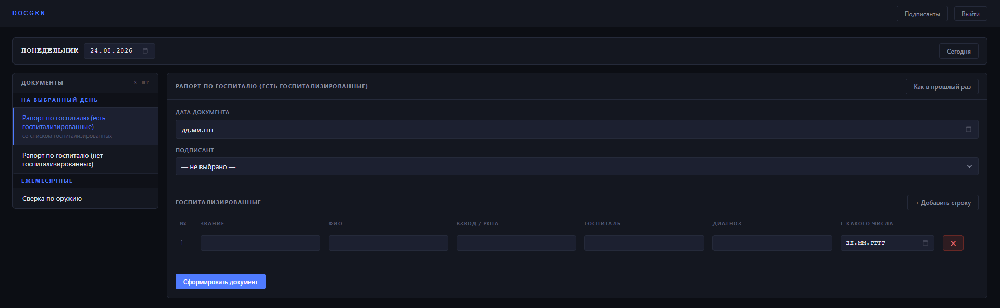

# DocGen

Веб-приложение для генерации служебных документов Word по шаблонам.

## Задача

Каждый рабочий день нужно оформлять один и тот же набор документов. Файлы одни и те же, меняются в них несколько значений: дата, подписант, пара чисел. Раньше это делалось руками — открыть прошлый файл, найти нужные места, поправить, сохранить под новым именем.

DocGen убирает ручную правку: приложение показывает документы, необходимые для работы на выбранный день, строит под каждый форму из нужных полей и по нажатию кнопки отдаёт готовый `.docx`.

Сейчас в системе 10 шаблонов, 6 еженедельных и 1 ежемесячный (плюс варианты).



## Стек

- Java 17, Spring Boot 4.1
- Spring Data JPA + PostgreSQL, миграции через Flyway
- Spring Security — сессионная аутентификация, form login
- Apache POI 5.4.0 — работа с `.docx`
- springdoc-openapi (Swagger UI), Lombok, Maven

Фронтенд — статические страницы на чистом HTML/CSS/JS, без фреймворков.

## Запуск

Нужны JDK 17 и PostgreSQL.

```bash
createdb doc_gen

export DB_PASSWORD=...          # пароль пользователя postgres
export TEMPLATES_PATH=...       # папка с файлами шаблонов

./mvnw spring-boot:run
```

Приложение поднимется на `http://localhost:8082`, Swagger — на `/swagger-ui/index.html`.

Схема БД и справочные данные (шаблоны, поля форм, пользователи) создаются миграциями Flyway при первом запуске. Рабочие шаблоны в репозиторий не входят; в `templates-example/` лежат три обезличенных файла, по которым видно формат разметки.

## Как устроено

### Данные

```
users ──< documents >── samples ──< sample_fields
              │                          │
              ├──< inputs >──────────────┘
              │       │
              │       └──> signers
              └──< hospital_rows
```

- **samples** — шаблон: путь к файлу, день недели или признак «ежемесячный»
- **sample_fields** — описание одного поля формы: плейсхолдер, подпись, тип, порядок
- **documents** — факт генерации: что, кто, когда
- **inputs** — введённые значения; для поля-подписанта заполняется ссылка на справочник, для остальных — строка
- **hospital_rows** — строки таблицы госпитализированных, число их переменное
- **signers** — справочник подписантов с падежными формами

### Путь запроса

1. `GET /api/v1/samples?date=` — какие документы положены на этот день
2. `GET /api/v1/samples/{id}` — шаблон вместе с описанием полей; фронт строит форму по `sample_fields`, тип поля определяет элемент ввода
3. `POST /api/v1/documents` — значения формы; в одной транзакции сохраняется документ со всеми значениями, собирается файл и отдаётся в ответ

Готовые файлы не хранятся: они воспроизводимы из шаблона и сохранённых значений.

### Типы полей

| Тип | Что делает при генерации |
|---|---|
| `TEXT`, `NUMBER` | подставляет значение как есть |
| `DATE` | форматирует в вид «01» января 2026 г. |
| `WEEK_START` | одна дата разворачивается в семь: `${day1}`…`${day7}` |
| `SIGNATORY` | выбор из справочника разворачивается в девять значений: должность, три падежа звания, сокращённое звание, три формата ФИО |
| `OPTIONAL_NUMBER` | ноль убирает показатель из перечисления вместе с подписью и запятой |

## Ключевые решения

**Поля формы описаны в базе, а не в коде.** Вместо написания кода под генерацию каждого шаблона отдельно с различными эндпоинтами в контроллерах, поля форм хранятся в БД, формы на фронте создаются динамически, чтобы добавить новый документ необходимо просто произвести одну миграцию.

**Разворачивание значений — один `switch` по типу поля.** Одно поле формы может давать в документ несколько подстановок: подписант — девять, первый день недели — семь. Логика собрана в одном месте, ветка на тип; ни одного условия вида «если это четверговый документ»; максимальная адаптивность к добавлению новых данных и документов.

**Слой генерации не знает про JPA.** Интерфейс `DocumentGenerator` принимает `Map<String, String>`, `List<List<String>>` и путь к файлу. Реализация на Apache POI не зависит от сущностей: переименование поля в модели её не ломает.

**Ничего не удаляется физически.** У подписантов и пользователей флаг `active`, внешние ключи от документов стоят на запрет удаления. Документ, сгенерированный полгода назад, должен показывать того, кто его подписывал, даже если человек давно переведён.

**Падежные формы хранятся, а не вычисляются.** Часть документов требует «сержанта Иванова Ивана Ивановича» и «сержантом Ивановым И.И.». Автоматическое склонение русских фамилий существует, но на редких случаях может ошибаться. Формы заполняются один раз при заведении человека в справочник.

## Границы

Тесты в проекте отсутствуют сознательно: он делался в сжатый срок как рабочий инструмент.

Фронтенд и модуль генерации `.docx` написаны с помощью Claude; backend — сущности, репозитории, сервисы, контроллеры, обработка ошибок, Security, миграции — самостоятельно.